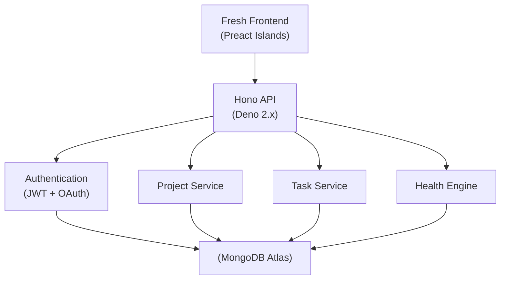
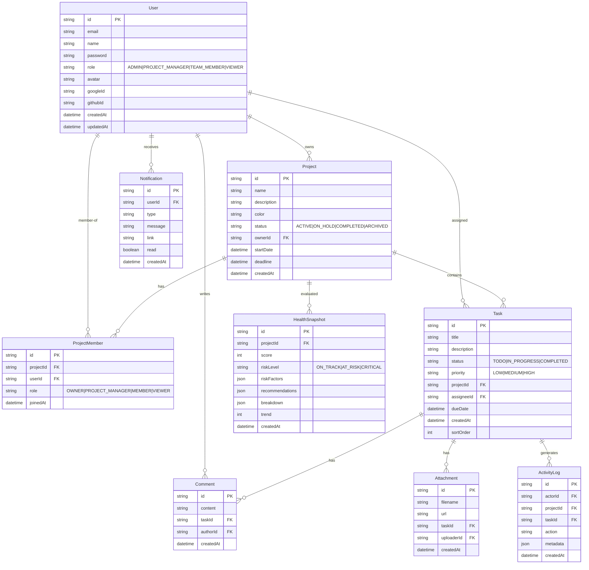

<div align="center">

# ProjectFlow

### *Production-ready Project & Task Management Platform*

**Plan less. Ship more. Together.**

`🚀 30+ API Endpoints` `🔐 OAuth + JWT Auth` `📊 4 Analytics Modules` `👥 8-Level RBAC` `📱 PWA Ready` `⚡ Deno Deploy`

[](https://projectflow.engsiam.deno.net)
[](https://projectflow-backend.engsiam.deno.net/docs)
[](https://deno.com)
[](https://fresh.deno.dev)
[](https://hono.dev)
[](https://www.prisma.io)
[](https://www.mongodb.com/atlas)
[](https://www.typescriptlang.org)
[](https://developer.mozilla.org/en-US/docs/Web/Progressive_web_apps)
[](LICENSE)
[](CONTRIBUTING.md)

<br />

[**Live Demo**](https://projectflow.engsiam.deno.net) · [**API Docs**](https://projectflow-backend.engsiam.deno.net/docs) · [**Report Bug**](https://github.com/engsiam/ProjectFlow-Task-Management-APP/issues) · [**Request Feature**](https://github.com/engsiam/ProjectFlow-Task-Management-APP/issues)

</div>

---

## 📊 Project Metrics

| Metric | Value |
|--------|-------|
| API Endpoints | 30+ |
| Role Levels | 8 (4 global + 4 per-project) |
| Authentication Methods | 3 (Email, Google OAuth, GitHub OAuth) |
| Analytics Modules | 4 (Dashboard, Per-Project, Portfolio, Health) |
| Database Collections | 8 |
| Frontend Islands | 44 |
| Routes | 15 |
| PWA Support | Yes |
| Database | MongoDB Atlas |
| Deployment | Deno Deploy (production) |

---

## 🎥 Product Walkthrough

<div align="center">
  <a href="https://www.youtube.com/watch?v=VtzrsMrxluA" target="_blank">
    
  </a>
  <p><sub>▶️ Click the thumbnail to watch on YouTube (opens in new tab)</sub></p>
</div>

## 🏃 Quick Preview

Jump straight into the live app at **[projectflow.engsiam.deno.net](https://projectflow.engsiam.deno.net)** using any of these demo accounts:

| Email | Password | Role | What you can explore |
|-------|----------|------|---------------------|
| `admin@projectflow.dev` | `Admin#12345` | ADMIN | Full access — create/delete projects, manage members, all analytics |
| `olivia@projectflow.dev` | `Olivia#12345` | PROJECT_MANAGER | Create projects, invite members, manage tasks |
| `liam@projectflow.dev` | `Liam#12345` | TEAM_MEMBER | Kanban board, comments, file uploads |
| `noah@projectflow.dev` | `Noah#12345` | VIEWER | Read-only: browse projects, tasks, charts, reports |

---

## 🚀 Why ProjectFlow?

| Feature | ProjectFlow | Typical CRUD App |
|---|---|---|
| Authentication & JWT Sessions | ✓ | ✓ |
| Kanban Workflow (Drag & Drop) | ✓ | ✗ |
| Analytics Dashboard | ✓ | ✗ |
| Project Health Intelligence (0–100) | ✓ | ✗ |
| Portfolio Risk Matrix | ✓ | ✗ |
| Workload Balancing | ✓ | ✗ |
| Activity Heatmap (90-day) | ✓ | ✗ |
| Gantt Timeline | ✓ | ✗ |
| OAuth Login (Google + GitHub) | ✓ | ✗ |
| PWA Support | ✓ | ✗ |
| Two-Layer RBAC (8 roles) | ✓ | ✗ |
| PDF Report Export | ✓ | ✗ |
| Predictive Completion Forecasting | ✓ | ✗ |
| Real-time Notifications | ✓ | ✗ |
| Global Command Palette (Cmd+K) | ✓ | ✗ |
| Deno Deploy Production | ✓ | ✗ |
| Swagger/OpenAPI Documentation | ✓ | ✗ |
| CSV Task Export | ✓ | ✗ |

---

## 👨‍💼 Why This Project Stands Out

This repository demonstrates **full-stack engineering proficiency** across the entire software development lifecycle — from database schema design to production deployment on a serverless edge runtime.

### Full-Stack Architecture

The project is split into two independently deployable Deno applications: a **Hono REST API** and a **Fresh + Preact frontend**. The backend follows a clean layered architecture (routes → controllers → services → Prisma ORM → MongoDB Atlas) with Zod-validated OpenAPI 3 specs generated directly from route definitions. The frontend uses Fresh's island architecture — interactive Preact components hydrate only where needed, delivering sub-100ms page loads without a bundler.

### Production-Grade Authentication

Implementing **JWT access/refresh token rotation** with bcrypt password hashing, **Google & GitHub OAuth 2.0**, IP-based rate limiting on auth endpoints, and a **two-layer RBAC system** (4 global roles × 4 per-project roles = 8 distinct permission levels) demonstrates strong security engineering.

### Database Design

The MongoDB schema covers 8 collections with proper indexing, foreign key relationships via Prisma, and a document model designed for the task management domain. The **health snapshot** collection stores deterministic score computations alongside risk factors, recommendations, and historical trend data — enabling the predictive analytics engine without external services.

### Enterprise Analytics Suite

The analytics system spans four levels: **workspace dashboard** (aggregate KPIs, trends, team workload), **per-project analytics** (member productivity, task distribution), **portfolio intelligence** (cross-project health comparison, risk matrix), and **project health scoring** (0–100 weighted multi-signal algorithm with completion forecasting). This demonstrates the ability to design, implement, and visualize complex data pipelines.

### Frontend Engineering

The UI uses **CSS custom properties** for theming (no Tailwind dependency), responsive grid layouts, SVG-powered progress rings and donut gauges, Recharts for analytics, and a **command palette** (Cmd+K) for instant project/task/member search. The **PDF report** feature uses native `window.print()` with `@media print` CSS — a zero-dependency approach to document generation.

### API Documentation

Every backend route is documented via OpenAPI 3 with Zod validation schemas, exposed through Swagger UI at `/docs` and machine-readable JSON at `/openapi.json`. This shows commitment to **developer experience** and API-first design.

### Production Deployment

The application is **deployed and live** on Deno Deploy's global edge network, with health checks at `/health` and `/readyz`, automated Prisma client generation in CI, and a documented cold-start verification pipeline.

---

## Key Features

- **Authentication & Authorization** — JWT access/refresh token rotation, email/password signup, Google & GitHub OAuth 2.0
- **Project Management** — Create, edit, archive, restore, with start/deadline dates, per-project colors, status workflow (Active / On Hold / Completed / Archived)
- **Task Management** — Three-column Kanban (To Do / In Progress / Completed), priority levels, assignees, due dates, labels, threaded comments, file attachments, CSV export
- **Role-Based Access Control** — Two-layer RBAC: global roles (ADMIN / PROJECT_MANAGER / TEAM_MEMBER / VIEWER) + per-project roles (OWNER / PROJECT_MANAGER / MEMBER / VIEWER)
- **Analytics Dashboard** — Workspace KPIs, task status/priority mix, 30-day trends, per-project analytics, member workload, productivity comparisons
- **Project Health Intelligence** — Deterministic 0–100 health score blended from 5 signals (overdue tasks, velocity, deadline proximity, engagement, workload balance); risk classification (ON_TRACK / AT_RISK / CRITICAL); completion forecasting; historical trends
- **Executive Command Center** — Dashboard hero with workspace health score ring, project/task/completion/at-risk stats, weekly trend indicator
- **Portfolio Risk Matrix** — `/portfolio` page with health score overview, risk matrix table, portfolio insights cards, expandable per-project health intelligence
- **Gantt Timeline** — Project Detail Timeline tab with week-header rows, colored bars by status, overdue markers, today line
- **Activity Heatmap** — GitHub-style 90-day contribution grid with 5-level intensity coloring
- **Workload Balancer** — Team workload analysis with balanced/overloaded/underutilized stats, bar chart, deterministic redistribution recommendations
- **Insights Assistant** — Rule-based recommendations engine for overdue tasks, overloaded members, low velocity, unassigned tasks, engagement gaps
- **PDF Report Export** — Zero-dependency print-to-PDF via `window.print()` with `@media print` CSS, accessible from Project Detail
- **Real-time Notifications** — In-app notification center for task assignments, status changes, mentions
- **Global Command Palette** — Cmd+K / Ctrl+K search for projects, tasks, and members
- **Mobile-first Responsive UI** — Fully responsive layouts, touch-friendly, PWA installable on iOS and Android

---

## 🏗️ System Design Overview

The frontend-backend split maps to two independent Deno Deploy projects, each deployable with zero shared infrastructure.

| Layer | Stack | Key Design Decision |
|-------|-------|-------------------|
| **UI** | Fresh islands + CSS custom properties | No bundler — island hydration ships JS only for interactive components |
| **API** | Hono + Zod + OpenAPI | Validation schemas auto-generate OpenAPI 3 docs; invalid requests rejected at route layer |
| **DB** | MongoDB via Prisma ORM | Document model nests comments/attachments under tasks; typed schema prevents runtime drift |
| **Auth** | JWT rotation + OAuth 2.0 | Stateless tokens scale horizontally; OAuth delegates credential security to providers |
| **Health** | Deterministic rule engine | Reproducible, auditable scores — zero external API dependency |

---

## Architecture



## Database Schema



---

## Screenshots

### Authentication

| Sign In | Home / Landing |
|---------|---------|
|  |  |

### Dashboard

| Executive Dashboard | Analytics |
|--------------------|-----------|
|  |  |

### Project Management

| Projects List | Project Detail | Kanban Board |
|----------|----------------|--------------|
|  |  |  |

### Team & Settings

| Team Members | Settings |
|---------|----------|
|  |  |

---

## Tech Stack

### Frontend

| Technology | Purpose |
|------------|---------|
| [Deno Fresh 1.7](https://fresh.deno.dev/) | Web framework with island architecture |
| [Preact 10](https://preactjs.com/) | Lightweight React-compatible rendering |
| [TypeScript 5](https://www.typescriptlang.org/) | Type-safe development |
| CSS Custom Properties | Theming (dark mode) — no Tailwind dependency |
| [Recharts](https://recharts.org/) | Analytics charting library |

### Backend

| Technology | Purpose |
|------------|---------|
| [Deno 2.x](https://deno.com/) | JavaScript/TypeScript runtime |
| [Hono 4.6](https://hono.dev/) | Lightweight HTTP framework |
| [Prisma 5.22](https://www.prisma.io/) | Type-safe ORM (MongoDB connector) |
| [MongoDB Atlas](https://www.mongodb.com/atlas/) | Document database |
| [Zod 3.23](https://zod.dev/) | Schema validation |
| [@hono/zod-openapi](https://github.com/honojs/middleware) | OpenAPI 3 spec generation |
| [JWT](https://jwt.io/) | Access & refresh token auth |
| [bcryptjs](https://github.com/dcodeIO/bcrypt.js) | Password hashing |

### Infrastructure

| Service | Purpose |
|---------|---------|
| [Deno Deploy](https://deno.com/deploy) | Production hosting (backend + frontend) |
| [GitHub](https://github.com/) | Source control & CI |
| [Swagger UI](https://swagger.io/tools/swagger-ui/) | Interactive API explorer |

---

## 💡 Technical Highlights

### Zero-Dependency PDF Reports
PDF Export uses `window.print()` with `@media print` CSS — no jsPDF, no Puppeteer, no server-side rendering. Print styles hide navigation, sidebars, and interactive elements while preserving data tables and charts.

### Predictive Completion Forecasting
The health engine estimates completion dates using `remaining_tasks / 7_day_velocity`. On-track probability derives from health score distance to risk thresholds — deterministic, auditable, and explainable.

### Island Architecture Performance
Fresh delivers ~45 KB initial JS (vs 200+ KB for typical React SPAs). Each interactive component hydrates independently when it enters the viewport. Complex islands (Kanban, Analytics, Command Palette) don't block page rendering.

### CSS-Only Animations
Health score rings, portfolio risk matrix highlights, and dashboard stat cards use CSS custom property transitions and `conic-gradient()` for SVG-free progress rings — zero animation library.

---

## Project Health Intelligence

Health Intelligence is a **deterministic, rule-based analytics engine** — no AI, no LLM, no external APIs. It computes a 0–100 health score for every project from five weighted signals drawn from live database data:

| Signal | Weight | What it measures |
|-------:|:------:|:-----------------|
| Overdue tasks | 30 | Ratio of overdue non-completed tasks |
| Completion velocity (7-day) | 20 | Tasks shipped per week |
| Deadline proximity | 25 | Distance from now to project deadline |
| Team engagement | 15 | Active members in last 7 days |
| Workload balance | 10 | Standard deviation of open tasks across assignees |

**Risk classification** (auto-derived from the score):

- **ON_TRACK** — score ≥ 70
- **AT_RISK** — score 40–69
- **CRITICAL** — score < 40

**Predictive outputs:**

- Predicted completion date (remaining tasks / 7-day velocity)
- On-track probability (0–1 estimate)
- Score trend with direction indicator
- Historical sparkline (last 30 snapshots)

**Per-project surface:**

- Top 3 risk factors (severity-ranked)
- Recommended actions (prescriptive next steps)
- Per-signal score breakdown with progress bars

**Workspace overview (dashboard):**

- Average health score across all projects
- On-track / at-risk / critical counts
- Top 5 risk + Top 5 healthy projects

### API

| Method | Path | Purpose |
|--------|------|---------|
| `GET` | `/api/projects/:projectId/health` | Score, risk, factors, recommendations, breakdown, trend |
| `POST` | `/api/projects/:projectId/health/refresh` | Force recompute + persist snapshot |
| `GET` | `/api/projects/:projectId/health/history` | Last 30 snapshots for trend chart |
| `GET` | `/api/dashboard/health` | Workspace summary |

---

## 🧗 Engineering Challenges & Decisions

### Real-time Collaboration Without WebSockets
**Problem**: Task assignments and mentions need to feel immediate, but WebSocket infrastructure on Deno Deploy's stateless edge is non-trivial.
**Solution**: 15-second polling + optimistic UI updates. Kanban cards update instantly on drag; the PATCH request fires in background. Conflicts resolve via last-write-wins, reconciled on the next poll.

### Deterministic Health Scoring
**Problem**: Health scores must be reproducible, auditable, and explainable — black-box ML won't work.
**Solution**: Five weighted signals (overdue ratio, velocity, deadline proximity, engagement, workload balance) from live DB queries. Formula is transparent, each refresh logs the breakdown, historical snapshots verify trends.

### Composable RBAC Middleware
**Problem**: No authorization framework exists for Hono/Fresh — every route needs global + per-project role checking.
**Solution**: A composable middleware chain: `authenticate` → `requireRole('ADMIN')` → `requireProjectRole('OWNER')`. Each middleware resolves context from JWT payload + Prisma queries, returning 401/403 immediately on failure.

### MongoDB Relations Without JOINs
**Problem**: MongoDB has no JOINs across 8 interrelated collections.
**Solution**: Prisma's MongoDB connector provides relational queries over a document database. Indexes on foreign key fields keep aggregation pipelines under 100ms. Embedded comments/attachments reduce collection scans.

### CSV Export at the Edge
**Problem**: Deno Deploy has no filesystem — `fs.writeFileSync` doesn't exist.
**Solution**: Stream CSV rows using Deno's `TextEncoder` + `Response` body streaming. Frontend receives the stream as a Blob and triggers download via `URL.createObjectURL`.

---

## Live Deployment

| Service | URL | Purpose |
|---------|-----|---------|
| Frontend | https://projectflow.engsiam.deno.net | User-facing web application |
| Backend API | https://projectflow-backend.engsiam.deno.net | REST API |
| Swagger UI | https://projectflow-backend.engsiam.deno.net/docs | Interactive API documentation |
| OpenAPI JSON | https://projectflow-backend.engsiam.deno.net/openapi.json | Machine-readable spec |
| Health Check | https://projectflow-backend.engsiam.deno.net/health | Liveness probe |
| Readiness | https://projectflow-backend.engsiam.deno.net/readyz | DB-backed readiness probe |

---

## Quick Start

### Prerequisites

| Tool | Version | Required For |
|------|---------|--------------|
| [Deno](https://deno.land/) | 2.0+ | Backend and frontend runtime |
| [MongoDB](https://www.mongodb.com/try) | 6.0+ | Database (local or Atlas free tier) |
| [Git](https://git-scm.com/) | latest | Cloning the repository |

### Setup

```bash
# 1. Clone
git clone https://github.com/engsiam/ProjectFlow-Task-Management-APP.git
cd ProjectFlow-Task-Management-APP

# 2. Start MongoDB (Docker)
docker run -d --name projectflow-mongo -p 27017:27017 mongo:7

# 3. Backend
cd backend
cp .env.example .env        # edit DATABASE_URL if needed
deno task prisma:push       # apply schema to MongoDB
deno task seed              # (optional) load demo data
deno task dev               # starts at http://localhost:8000

# 4. Frontend (new terminal)
cd ../frontend
cp .env.example .env        # set API_BASE_URL=http://localhost:8000/api
deno task dev               # starts at http://localhost:8001
```

Open **http://localhost:8001** and sign in with the seeded demo accounts.

### Environment Variables

#### Backend (`backend/.env`)

```env
# Required
DATABASE_URL="mongodb://localhost:27017/projectflow"
JWT_ACCESS_SECRET="<32+ random bytes>"
JWT_REFRESH_SECRET="<32+ random bytes>"

# Optional
PORT=8000
NODE_ENV=development
FRONTEND_URL=http://localhost:8001
OAUTH_REDIRECT_URL=http://localhost:8000/api/auth

# OAuth
GOOGLE_CLIENT_ID=
GOOGLE_CLIENT_SECRET=
GITHUB_CLIENT_ID=
GITHUB_CLIENT_SECRET=

# Storage
UPLOAD_DIR=uploads
STORAGE_BACKEND=local
```

#### Frontend (`frontend/.env`)

```env
API_BASE_URL=http://localhost:8000/api
```

---

## Role-Based Access Control

### Global Roles

| Role | Create Project | Manage Members | Manage Roles | Delete Anything |
|------|:--------------:|:--------------:|:------------:|:---------------:|
| ADMIN | ✓ | ✓ | ✓ | ✓ |
| PROJECT_MANAGER | ✓ | ✓ (own projects) | ✗ | ✗ |
| TEAM_MEMBER | ✗ | ✗ | ✗ | ✗ |
| VIEWER | ✗ | ✗ | ✗ | ✗ |

### Per-Project Roles

| Role | Edit Project | Invite | Create Tasks | Assign | Delete Tasks |
|------|:------------:|:------:|:------------:|:------:|:------------:|
| OWNER | ✓ | ✓ | ✓ | ✓ | ✗ |
| PROJECT_MANAGER | ✗ | ✓ | ✓ | ✓ | ✗ |
| MEMBER | ✗ | ✗ | ✓ (assigned only) | ✗ | ✗ |
| VIEWER | ✗ | ✗ | ✗ | ✗ | ✗ |

> Only ADMIN can delete projects, archive projects, or remove members.

---

## API Endpoints

All endpoints live under `/api`. Full documentation is available at **`/docs`** (Swagger UI) and **`/openapi.json`** (raw spec).

### Auth (`/api/auth`)

| Method | Path | Description |
|--------|------|-------------|
| POST | `/api/auth/signup` | Create account |
| POST | `/api/auth/login` | Email + password login |
| POST | `/api/auth/refresh` | Rotate access token |
| POST | `/api/auth/logout` | Invalidate session |
| GET | `/api/auth/me` | Current user profile |
| GET | `/api/auth/google` | Google OAuth flow |
| GET | `/api/auth/github` | GitHub OAuth flow |

### Users (`/api/users`)

| Method | Path | Description |
|--------|------|-------------|
| PATCH | `/api/users/me` | Update own profile |
| GET | `/api/users/search` | Search users for invites |
| GET | `/api/users/:userId` | Public profile |
| PATCH | `/api/users/:userId/role` | Admin-only role change |

### Projects (`/api/projects`)

| Method | Path | Description |
|--------|------|-------------|
| GET | `/api/projects` | List user's projects |
| POST | `/api/projects` | Create project |
| GET | `/api/projects/:id` | Project detail |
| PATCH | `/api/projects/:id` | Edit project |
| POST | `/api/projects/:id/archive` | Archive project |
| DELETE | `/api/projects/:id` | Admin-only delete |
| GET | `/api/projects/:id/members` | List members |
| GET | `/api/projects/:id/activity` | Activity feed |
| GET | `/api/projects/:id/export/tasks.csv` | CSV export |

### Tasks (`/api/projects/:id/tasks`)

| Method | Path | Description |
|--------|------|-------------|
| GET | `/api/projects/:id/tasks` | List tasks (paged, filtered, sorted) |
| POST | `/api/projects/:id/tasks` | Create task |
| GET | `/api/tasks/:id` | Task detail |
| PATCH | `/api/tasks/:id` | Update task |
| POST | `/api/tasks/:id/move` | Change status |
| DELETE | `/api/tasks/:id` | Admin-only delete |

### Comments, Notifications, Uploads

| Method | Path | Description |
|--------|------|-------------|
| POST | `/api/tasks/:id/comments` | Add comment |
| GET | `/api/tasks/:id/comments` | List comments |
| GET | `/api/notifications` | List notifications |
| PATCH | `/api/notifications/:id` | Mark notification read |
| POST | `/api/uploads/avatar` | Upload avatar |
| POST | `/api/projects/:id/tasks/:taskId/attachments` | Upload attachment |

### System

| Method | Path | Description |
|--------|------|-------------|
| GET | `/health` | Liveness probe |
| GET | `/readyz` | DB-backed readiness probe |
| GET | `/api/dashboard` | Personal dashboard |
| GET | `/api/dashboard/portfolio` | Portfolio & executive overview |
| GET | `/api/dashboard/health` | Workspace health summary |
| GET | `/api/analytics/dashboard` | Workspace analytics |
| GET | `/api/analytics/project/:projectId` | Per-project analytics KPIs |

---

## Deployment

ProjectFlow is production-verified for [Deno Deploy](https://deno.com/deploy).

### One-Click Deploy

1. Push this repository to GitHub.
2. In [Deno Deploy](https://dash.deno.com/), create a new project from your repository.
3. Configure:

   | Setting | Value |
   |---------|-------|
   | App Directory | `backend` |
   | Entrypoint | `src/server.ts` |
   | Build Command | `deno task build:deploy` |
   | Health Check Path | `/readyz` |

4. Add environment variables:
   - `DATABASE_URL` — MongoDB Atlas connection string
   - `JWT_ACCESS_SECRET` — 32+ random bytes
   - `JWT_REFRESH_SECRET` — 32+ random bytes
   - `FRONTEND_URL` — your deployed frontend URL

5. Deploy.

### Pre-flight Checklist

- [ ] `deno task prisma:generate` runs locally
- [ ] Build Command set to `deno task build:deploy`
- [ ] Health Check Path set to `/readyz`
- [ ] `DATABASE_URL` points to MongoDB Atlas
- [ ] `FRONTEND_URL` matches deployed frontend origin
- [ ] JWT secrets are strong random values

---

## Development Scripts

### Backend

| Task | Description |
|------|-------------|
| `deno task dev` | Watch mode with hot reload |
| `deno task start` | Production-style start |
| `deno task prisma:generate` | Regenerate Prisma client |
| `deno task prisma:push` | Push schema to MongoDB |
| `deno task prisma:studio` | Open Prisma Studio |
| `deno task seed` | Seed demo data |
| `deno task typecheck` | Type-check backend |

### Frontend

| Task | Description |
|------|-------------|
| `deno task dev` | Fresh dev server on port 8001 |
| `deno task start` | Build & start production server |
| `deno task build` | Pre-render static pages |
| `deno task check` | Type-check (Fresh + Preact) |

### Quality

```bash
deno task typecheck     # Type-check
deno fmt --check        # Format check
deno lint               # Lint
```

---

## Project Structure

```
ProjectFlow-Task-Management-APP/
├── backend/                    # Deno + Hono + Prisma API
│   ├── src/
│   │   ├── config/             # Environment, CORS
│   │   ├── controllers/        # Route handlers
│   │   ├── middleware/          # Auth, RBAC, rate-limit, error
│   │   ├── prisma/             # Prisma client singleton
│   │   ├── routes/             # OpenAPI route definitions
│   │   ├── services/           # Business logic
│   │   ├── types/              # Domain enums, context types
│   │   ├── utils/              # Cache, errors, response, CSV
│   │   ├── app.ts              # Hono app factory
│   │   └── server.ts           # Entrypoint
│   ├── prisma/
│   │   ├── schema.prisma       # MongoDB schema
│   │   └── seed.ts             # Demo data seeder
│   ├── scripts/
│   ├── deno.json
│   └── README.md
│
├── frontend/                   # Fresh + Preact UI
│   ├── islands/                # Interactive client components
│   ├── components/             # Server-rendered components
│   ├── lib/                    # API client, auth, RBAC
│   ├── routes/                 # Fresh pages
│   ├── static/                 # CSS, assets
│   ├── dev.ts                  # Dev entrypoint
│   ├── main.ts                 # Prod entrypoint
│   ├── fresh.config.ts
│   └── README.md
│
├── design/                     # Mockups, brand assets
└── README.md                   # You are here
```

---

## Contributing

1. Fork the repository
2. Branch from `main`: `git checkout -b feat/feature-name`
3. Commit your changes using [Conventional Commits](https://www.conventionalcommits.org/)
4. Push: `git push origin feat/feature-name`
5. Open a Pull Request

Ensure your PR passes:
- `deno task typecheck`
- `deno fmt --check`
- `deno lint`

---

## License

This project is licensed under the **MIT License** — see the [LICENSE](LICENSE) file for details.

---

<div align="center">

**Built with Deno, Fresh, Hono, Prisma, and MongoDB**

If ProjectFlow helped you ship faster, [give us a star](https://github.com/engsiam/ProjectFlow-Task-Management-APP)!

<br />

<sub>Copyright © 2026 ProjectFlow. MIT Licensed.</sub>

</div>
